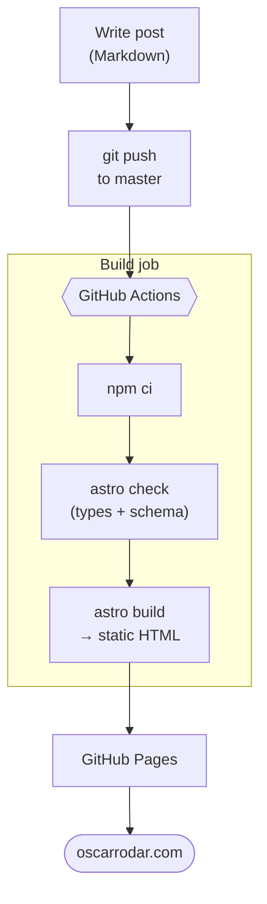
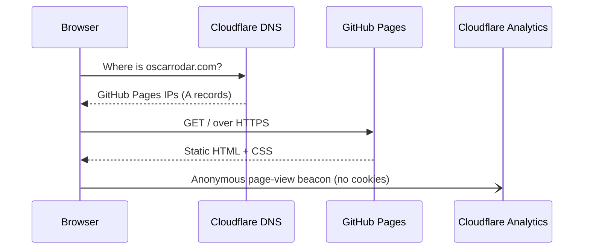

After years of building interfaces for other products, I finally built a home for my own work: a profile,
a blog, and a resume that lives as a real web page instead of a PDF. It took one Saturday afternoon. Here is
how it fits together, and the few things that tripped me up.

## The goals

I wanted four things:

- **Writing should be just Markdown.** No CMS, no database, no admin panel.
- **Fast and accessible by default.** As little JavaScript as possible, with good contrast, keyboard focus, and dark mode.
- **One source of truth for my resume.** Edit a JSON file once and the page updates everywhere.
- **Free, boring hosting.** Push to GitHub and the site updates itself.

## The stack

- **[Astro](https://astro.build)** generates the site. Pages ship zero JavaScript unless a component opts in, which fits a content site perfectly. Because it also supports React, I can drop in interactive pieces, like data-visualization demos, when a post needs one.
- **Content collections** hold the blog. Each post is a Markdown file whose frontmatter (title, date, tags, draft) is validated against a schema, so a typo in a date fails the build instead of shipping a broken page.
- **A JSON resume.** `resume.json` drives the resume page, and a print stylesheet means anyone can print it or save it as a clean PDF without me maintaining a second document.
- **GitHub Pages** hosts it, deployed by a **GitHub Actions** workflow.
- **Cloudflare** handles the domain, DNS, and cookie-free analytics.

## From a Markdown file to oscarrodar.com

This is the whole publishing pipeline. I write a post, push it, and a minute later it's live.

The `astro check` step is my favorite part. It type-checks the whole project and validates every post's
frontmatter, so mistakes stop at the build instead of reaching readers.

## What happens when you visit

The DNS records are set to **DNS only**, not proxied through Cloudflare, so GitHub can issue and renew the
HTTPS certificate itself. Analytics run without cookies, so there's no consent banner to click through.

## What broke (and the fixes)

**The first deploy failed.** Astro 7 needs Node 22.12 or newer, but the off-the-shelf deploy action defaulted
to an older Node. I replaced it with explicit steps (`actions/setup-node` pinned to Node 24, then
`npm ci` and `npm run build`) and added an `engines` field to `package.json` so the requirement is written down.

**My new domain showed GitHub's 404 page.** That one confused me for a minute. The DNS was right, since
the request was reaching GitHub, but verifying a domain in your *account* settings only proves you own it.
You still have to attach it to the *repository* under **Settings → Pages → Custom domain**. Once I did that,
the site came up and HTTPS followed a few minutes later.

**Diagrams.** The two diagrams in this post are written in [Mermaid](https://mermaid.js.org) right inside
the Markdown. Astro skips syntax-highlighting those blocks, and a small script turns them into SVG in the
browser. It loads the Mermaid library only on pages that actually contain a diagram, and it re-renders
when you switch between light and dark mode.

## Working with an AI pair

I built this with Claude as a pair programmer. It scaffolded the project, turned my LinkedIn PDF into
structured resume data, and debugged the failed deploy from the job log, while I made the calls on
design, wording, and what to keep. It felt a lot like pairing with a fast colleague who never gets tired
of reading build logs.

## What's next

- A **projects** page to showcase things I build.
- Posts on front-end architecture, data visualization, and accessibility, which is what I spend my days on.
- Maybe a Spanish version. Astro has built-in i18n routing, and it would be a shame not to use the other half of my vocabulary.

The source is public at [github.com/oscarrodar/oscarrodar.github.io](https://github.com/oscarrodar/oscarrodar.github.io)
if you want to borrow any of it.
