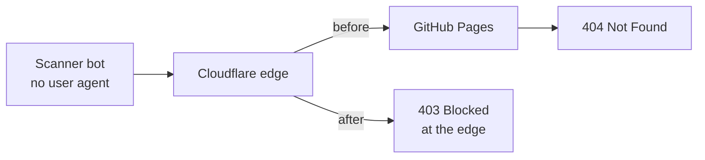

Five days after I launched this site, I opened the Cloudflare traffic dashboard expecting a handful of visits from friends. Instead I saw a spike: **1,190 requests in about five minutes**, almost all of them coming back as errors.

My first thought was "am I being attacked?" My second was "what is there even to attack?" This post covers what I found, why it turned out to be harmless, and the small changes I made anyway.

## What the dashboard showed

The traffic overview for that five-minute window looked like this:

- **Total requests:** 1.19k
- **Total visits:** 0
- **Requests by country:** Poland 1.18k, United States 4
- **Top client IP:** a single address responsible for ~1,180 requests
- **User agent:** `None` for ~1,180 requests
- **Status codes:** 2xx: 2 · 3xx: 2 · **4xx: 1.18k** · 5xx: 3
- **Cache hit rate:** ~25%

And the top requested paths:

```text
/mysql/dump.sql
/src.zip
/wp-content/uploads/dump.bak
/upload.tar.gz
/uploads/database.sql
/backup.sql.gz
/backup-2026-10.zip
/jun.sql
/files.tar.gz
...
```

None of those files exist on my site. I'd never even heard of most of those names.

## What was actually going on

This was an **automated vulnerability scan**. Someone's bot has a list of common backup and database filenames and tries every one of them against as many domains as it can reach, hoping that somebody, somewhere, left `backup.sql.gz` sitting in their web root.

A few clues gave it away:

- **One IP, no user agent.** Real browsers always send a `User-Agent` header. A script that doesn't bother is about as obvious as it gets.
- **Zero visits.** Cloudflare didn't count a single one of those requests as a human page view.
- **The paths are a wordlist.** `dump.sql`, `backup-mar.zip`, `wp-content/...`: the scanner is guessing at WordPress installs, MySQL exports and source archives. It wasn't looking for *me*, it was looking for *anyone*.
- **Almost everything got a 404.** The scanner asked for ~1,180 files and found none of them.

The low cache hit rate makes sense too: every request was for a different made-up URL, so Cloudflare had nothing cached and passed most of them to the origin. The three 503s were most likely GitHub Pages briefly pushing back on the burst.

## Why it couldn't find anything

This site is static. As I wrote in [How I built this site](/blog/how-i-built-this-site), it's Astro generating plain HTML, deployed by GitHub Actions to GitHub Pages, with Cloudflare in front for the domain.

That means:

- There's **no database** to dump.
- There's **no WordPress**, no PHP, no admin panel.
- There's **no server I manage**, so there's no backup directory to leave lying around.
- The only files that exist are the ones the build outputs.

Here's the path the scanner's requests took:



So the scan was background noise. Every public domain gets these. Still, there was no reason to keep forwarding junk traffic to GitHub, so I made two small changes, both on Cloudflare's free plan.

## Change 1: Bot Fight Mode

In Cloudflare, under **Security → Settings**, I filtered by "Bot traffic" and turned on **Bot fight mode**. This makes Cloudflare challenge or block requests that match known bot fingerprints before they ever reach the origin.

One trade-off on the free plan: you can't write exceptions for it. For a static portfolio site with no API and no webhooks, that's fine.

## Change 2: A WAF custom rule

Bot Fight Mode is a general net. I also wanted something targeted at exactly this kind of scan. Under **Security → Security rules → Create rule → Custom rules**, I added a rule called **Block scanners & backup probes** with the action set to **Block**:

```text
(http.user_agent eq "")
or (http.request.uri.path contains ".sql")
or (http.request.uri.path contains ".bak")
or (http.request.uri.path contains ".tar")
or (http.request.uri.path contains ".tgz")
or (http.request.uri.path contains ".zip")
or (http.request.uri.path contains "/wp-")
or (http.request.uri.path contains ".env")
or (http.request.uri.path contains "/.git")
```

The reasoning is simple: **this site will never legitimately serve any of those paths.** There's no WordPress, no `.sql` file, no archive downloads. So anything asking for them is a scanner, and it can be stopped at Cloudflare's edge instead of reaching GitHub.

I added `.env` and `/.git` even though they weren't in this scan. They're the next most common thing these bots look for, and leaked environment files and git directories are a real source of compromised secrets.

The free plan allows five custom rules, and this one uses just one of them.

> **Heads-up:** if your site *does* offer a `.zip` download, remove that line or you'll block your own visitors.

## Verifying it

Two quick checks from a terminal:

```bash
# Should now return 403 Forbidden
curl -I https://oscarrodar.com/test.sql

# Should still return 200 OK
curl -I https://oscarrodar.com/
```

Blocked requests also show up under **Security → Analytics → Events**, tagged with the rule name, which makes it easy to see when the next scanner comes by.

## What I took away from this

- **Look at your dashboards early.** I would never have noticed this if I hadn't opened Cloudflare out of curiosity.
- **Read the shape of the traffic, not just the volume.** One IP, no user agent, zero visits and a wall of 404s tells the whole story in a few seconds.
- **Static sites have a tiny attack surface.** Most of what these scanners hunt for simply doesn't exist on a site like this one. That was one of the reasons I chose this stack, and it paid off.
- **Cheap defense is still worth it.** Two free settings and about ten minutes, and the junk traffic now stops at the edge.

As with building the site, I worked through this with an AI pair: I pointed it at the Cloudflare dashboard, it helped me read the numbers, and it walked me through the settings. The decisions were still mine, but going from "is this bad?" to "fixed and verified" took minutes instead of an evening of searching forums.

If you run a small site behind Cloudflare, go open your traffic dashboard. There's a good chance someone has already come looking for your `backup.sql.gz` too.
